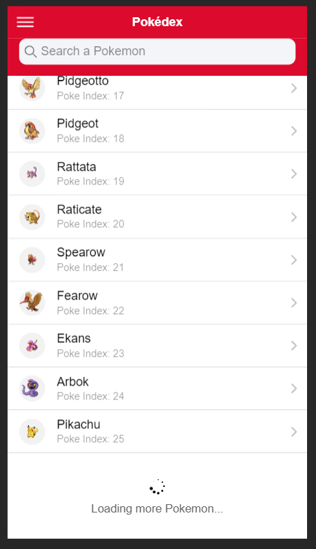

# ionic4-pokedex
ionic 4 app using PokéAPI The RESTful Pokémon API https://pokeapi.co/

# Installation

Simply clone the project and run it in your browser with an **ionic serve** command.

# Screenshots

  
  
  
  
  
  
  
  

# Mes excuses
Forgive me for my typo mistake ("**a** PokéAPI") on the about page, but I cannot be bothered to change it, because I've noticed it only during the README edit :grin:

  

  
  

